**[Projects](#projects) · [Stack](#stack) · [Journey](#journey) · [Leadership](#leadership) · [Activity](#activity) · [Contact](#contact)**

    

---

## What I build

<table>
<tr>
<td width="25%" valign="top" align="center"><picture><source media="(prefers-color-scheme: dark)" srcset="https://skillicons.dev/icons?i=py,sklearn&theme=dark&perline=12"></picture> <b>AI / ML</b> Predictive models, evaluation, browser-deployed inference</td>
<td width="25%" valign="top" align="center"><picture><source media="(prefers-color-scheme: dark)" srcset="https://skillicons.dev/icons?i=cpp,linux,cmake&theme=dark&perline=12"></picture> <b>SYSTEMS</b> C++ / STL / CMake on Linux, OS scheduling concepts</td>
<td width="25%" valign="top" align="center"><picture><source media="(prefers-color-scheme: dark)" srcset="https://skillicons.dev/icons?i=nodejs,express,mysql&theme=dark&perline=12"></picture> <b>BACKEND</b> REST APIs, authentication, CRUD, MySQL</td>
<td width="25%" valign="top" align="center"><picture><source media="(prefers-color-scheme: dark)" srcset="https://skillicons.dev/icons?i=docker,githubactions,postman&theme=dark&perline=12"></picture> <b>DEVOPS</b> Docker, GitHub Actions, automated API testing</td>
</tr>
</table>

## Technical arsenal

<table>
<tr><td><b>Languages</b></td><td><picture><source media="(prefers-color-scheme: dark)" srcset="https://skillicons.dev/icons?i=c,cpp,py,java,go&theme=dark&perline=12"></picture> C · C++ · Python · Java <i>(basics)</i> · Go <i>(beginner)</i></td></tr>
<tr><td><b>AI / ML</b></td><td><picture><source media="(prefers-color-scheme: dark)" srcset="https://skillicons.dev/icons?i=numpy,pandas,sklearn,matplotlib&theme=dark&perline=12"></picture> NumPy · Pandas · Scikit-learn · Matplotlib · Seaborn</td></tr>
<tr><td><b>Web</b></td><td><picture><source media="(prefers-color-scheme: dark)" srcset="https://skillicons.dev/icons?i=html,css,js,nodejs,express&theme=dark&perline=12"></picture> HTML · CSS · JavaScript · Node.js · Express.js</td></tr>
<tr><td><b>Databases</b></td><td><picture><source media="(prefers-color-scheme: dark)" srcset="https://skillicons.dev/icons?i=mysql,mongodb&theme=dark&perline=12"></picture> MySQL · MongoDB</td></tr>
<tr><td><b>Systems</b></td><td><picture><source media="(prefers-color-scheme: dark)" srcset="https://skillicons.dev/icons?i=linux,cmake,cpp&theme=dark&perline=12"></picture> Linux · CMake · C++ STL · Operating Systems</td></tr>
<tr><td><b>DevOps &amp; Testing</b></td><td><picture><source media="(prefers-color-scheme: dark)" srcset="https://skillicons.dev/icons?i=docker,githubactions,git,github,postman,vercel&theme=dark&perline=12"></picture> Docker · GitHub Actions · Git/GitHub · Postman · Newman · Vercel</td></tr>
<tr><td><b>Foundations</b></td><td>Data Structures &amp; Algorithms · Object-Oriented Programming</td></tr>
</table>

---

## Projects

### 01 · Predictive Maintenance for EV Stations
*A machine-learning model that predicts when EV charging stations need maintenance, served as a live browser app.*

<picture><source media="(prefers-color-scheme: dark)" srcset="https://skillicons.dev/icons?i=py,numpy,pandas,sklearn,vercel,github&theme=dark&perline=12"></picture>

<b>Engineering deep-dive (click to collapse)</b>

 

| | |
|---|---|
| **Problem** | Anticipate maintenance requirements for EV charging stations. |
| **Solution** | Logistic Regression and Random Forest models trained on 500 labeled records. |
| **Engineering** | Preprocessing and analysis, feature scaling, evaluation with precision, recall, F1-score and confusion matrix. |
| **Deployment** | Browser-based app on Vercel returning real-time predictions with confidence scores. |

[**▶ Live demo**](https://ev-maintenance-predictor.vercel.app/) · [Source code](https://github.com/lavendercoder1129/ev-maintenance-predictor)

---

### 02 · CPU Scheduling Simulator
*A C++ simulator that runs classic scheduling algorithms and measures how each one performs.*

<picture><source media="(prefers-color-scheme: dark)" srcset="https://skillicons.dev/icons?i=cpp,cmake,linux,git&theme=dark&perline=12"></picture>

<b>Engineering deep-dive (click to expand)</b>

 

| | |
|---|---|
| **Problem** | Compare how scheduling policies behave on the same workload. |
| **Solution** | FCFS, SJF, Priority and Round Robin implementations. |
| **Engineering** | Gantt chart visualization plus Waiting Time, Turnaround Time, Response Time and CPU Utilization for performance analysis. |

[**Source code →**](https://github.com/lavendercoder1129/CPU-Scheduling-Simulator)

---

### 03 · Automated API Testing &amp; CI/CD Pipeline
*A Student Management REST API wrapped in an automated regression-testing and containerized CI pipeline.*

<picture><source media="(prefers-color-scheme: dark)" srcset="https://skillicons.dev/icons?i=nodejs,express,mysql,postman,docker,githubactions&theme=dark&perline=12"></picture>

<b>Engineering deep-dive (click to expand)</b>

 

| | |
|---|---|
| **Problem** | Make sure every code change is verified before an application image is built. |
| **Solution** | REST API with authentication and CRUD operations on Node.js, Express.js and MySQL. |
| **Engineering** | Postman + Newman regression suite covering functional, validation, authentication and negative scenarios. Dockerized GitHub Actions pipeline runs the tests on code changes and builds the image only when tests pass. |

[**Source code →**](https://github.com/lavendercoder1129/Automated-API-tester)

---

## Engineering journey

<table>
<tr>
<td align="center" width="25%"><b>9.27 / 10</b> CGPA · B.Tech AIML</td>
<td align="center" width="25%"><b>Rank 1</b> Third Semester Results</td>
<td align="center" width="25%"><b>98.71%</b> MHT-CET</td>
<td align="center" width="25%"><b>92.07%</b> JEE Mains 2024</td>
</tr>
</table>

## Community &amp; leadership

<b>Walchand Linux Users' Group (WLUG)</b> — Content Head, Main Board · 2026–Present

 

- Manage WLUG's social media platforms, publishing content and captions to support technical outreach.
- Write blogs on emerging technologies and facilitate community engagement through polls and discussions.

<b>CodeChef WCE Chapter (CWC)</b> — Design Head, Main Board · 2026–Present

 

- Design posters, graphics and promotional material for technical events and competitions.
- Create visually engaging content aligned with event themes and chapter branding.

<b>NetNebula</b> — Networking session at LinuxDiary 7.0 · 9 August 2026

 

- Presented the NetNebula session on Networking during LinuxDiary 7.0, organized by WLUG.

---

## Activity

<picture>
<source media="(prefers-color-scheme: dark)" srcset="https://raw.githubusercontent.com/lavendercoder1129/lavendercoder1129/output/github-snake-dark.svg">

</picture>

<!--
## Currently exploring
Add only topics you are actually working on.
-->

---

### Let's build something useful.

    

